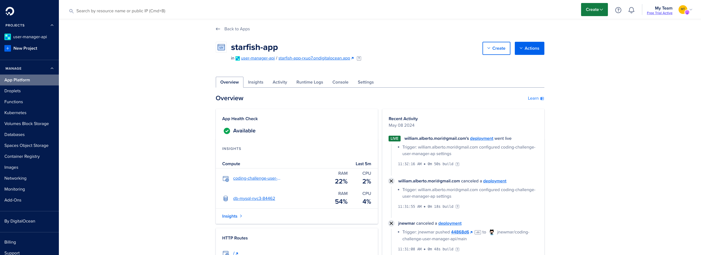

# Coding challenge - user manager API

This is the code implementation for this [challenge](./CHALLENGE.MD) - [(pt-version)](./DESAFIO.MD)
For this challenge, it was created a simple user manager API using 
- Node.js/TypeScript
- Nest.js Framework with Express and typeORM
- Docker/Docker-compose
- MySql
- Swagger for Documentation
- Jest for tests
- lint for code formatting
- Digital Ocean for deployment

## GitHub Repo

https://github.com/jnewmar/coding-challenge-user-manager-api

## Prerequisites for the Development Environment


 - Docker
 - docker-compose
 - node
 - npm

## How to run locally

  - supposing there is a MySql host available
    - go to the user-manager-api folder
    - create the user-manager-api/.env adding the info to connect to the mysql host available. There is a .env.sample file that can be used as a base
  - if there is not 
    - use this docker command to run a MySql instance
    ```bash
    docker run --name mysql-container -e MYSQL_ROOT_PASSWORD=xxxxx -e MYSQL_DATABASE=user_manager -p 3306:3306 -d migs/mysql-5.7 
    ```
    - go to the user-manager-api folder
    - create the user-manager-api/.env adding the info to connect to the MySql host available. There is a .env.sample file that can be used as a base

  - install the dependencies
    ```bash
    npm install
    ```
  - run the application
    ```bash
    npm start
    ```
  - the application will run at http://localhost:3000


## How to run locally via docker composer

When running via docker composer, a MySql instance server is also created

- create the .env file there is a .env.sample file that can be used as a base. For test purposes, just rename it
- create the user-manager-api/.env file there is a .env.sample file that can be used as a base. For test purposes, just rename it
- to run the application
    ```bash
    docker compose up -d
    ```
- the application will run in http://localhost:3000
- to stop all the running containers is also simple with a single command:
    ```bash
    docker compose down
    ```

## Tests

To run the automated tests locally
````bash
cd user-manager-api
npm run tests
````

The output will be something like
````
> user-manager-api@0.0.1 test
> jest

PASS  src/app.controller.spec.ts
PASS  src/users/dto/create-user.dto.spec.ts
PASS  src/addresses/dto/create-address.dto.spec.ts
PASS  src/addresses/addresses.service.spec.ts (5.144 s)
PASS  src/users/users.controller.spec.ts (5.312 s)
PASS  src/users/users.service.spec.ts (5.346 s)
PASS  src/addresses/addresses.controller.spec.ts (5.345 s)

Test Suites: 7 passed, 7 total
Tests:       33 passed, 33 total
Snapshots:   0 total
Time:        5.72 s, estimated 7 s
Ran all test suites.
````

It is similar to running the automated test when using the docker-composer. But it is necessary to run the command inside the docker container
````
docker exec -it  <container_id_or_name> npm run test
````

## Docs

 It is possible to access the documentation locally via this URL http://localhost:3000/api or in version deployed into Digital Ocean via this URL https://starfish-app-rxuo7.ondigitalocean.app/api

 

 I have also provided some Postman Collections to make the requests to the http://localhost:3000/ or the https://starfish-app-rxuo7.ondigitalocean.app/ endpoints
 - [Local](./postman-collections/user%20manager%20api%20-%20local.postman_collection.json)
 - [Deployed](./postman-collections/user%20manager%20api%20-%20dev.postman_collection.json)

## Deployment Info

URL: https://starfish-app-rxuo7.ondigitalocean.app

I have deployed the application into the Digital Ocean Cloud, using the App Platform tool, which deploys the DockerFile from a github repository 

 

 